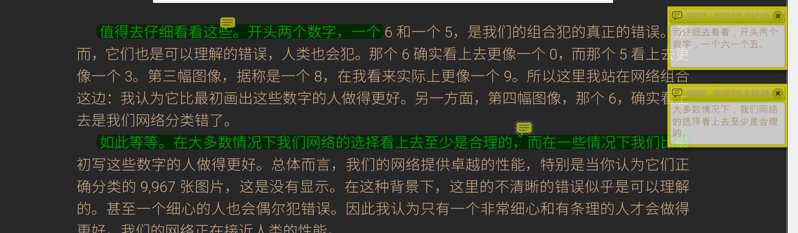

# Eye kindle

本项目依基于以下几个项目：

1. [百度语音识别api](https://ai.baidu.com/tech/speech)
2. [pdf-xchange viewer](https://www.tracker-software.com/product/pdf-xchange-viewer)
3. [Webcam-based Eye Tracking system](https://github.com/antoinelame/GazeTracking)
4. [deepgaze](https://github.com/mpatacchiola/deepgaze)

## Introduction

本项目是一个通过眼睛和头部姿态控制的PDF阅读器，为手部残疾或渐冻人等残疾人提供阅读和书写笔记的能力，包括以下几个功能：

* **人脸验证功能**
  * 验证不同用户，打开阅读器至该用户上次浏览的位置
* **鼠标移动跟踪功能**
  * 鼠标会跟随用户当前关注点，并且停留可以双击
* **翻页和拖动功能**
  * 通过注视阅读器的顶部和底部分别可以实现上下拖动页面
  * 通过注视阅读器的左侧和右侧分别可以实现上翻页和下翻页
* **注视高亮**
  * 用户对想要高亮的区域保持注视，则该区域被自动高亮显示
* **语音注释**
  * 用户张嘴即可在当前鼠标停留位置产生注释，并接受用户的语音输入，话音落下后自动关闭并进行语音识别，识别后的文字会在注释区显示。

## Results


## Require

1. Keras
2. opencv

2. pyaudio

## Contents

1. [采集数据集](#Initialize)
2. [训练模型](#Trian)
3. [开始使用](#Start )

## Initialize

首先运行`example.py`，弹出窗口后，检查识别是否正常，若不能检测到眼球，修改`trained_models/calibration.py`中`find_best_threshold`函数中的`average_iris_size = 1.0`参数，（改大参数更容易识别也更容易误判，注意调节），检查无误之后，开始录制数据集。

训练集采集：

1. 确认`trained_models/gaze_tracking.py`中`save_data`函数中`data_train1.npz`句被解除注释，而`data_val1.npz`被注释
2. 在保持图像窗口弹出时，按t开始录制，开始录制后全程保持注视鼠标，录制时尽量保存头部眼睛一起自然移动，不要只动眼睛不动头
3. 目标跟随鼠标，从左上角开始移动鼠标，均匀移动覆盖整个屏幕进行采集
4. 在屏幕上均匀分布取9个点，保持注视，移动头部或晃动身体，采集数据集
5. 在屏幕中央画圈，目光保持注视，画三圈
6. 按ESC键结束录制， 在结束确认退出前请保持注视鼠标，退出后采集的数据集保存在`data_train1.npz`中

验证集采集：

1. 确认`trained_models/gaze_tracking.py`中`save_data`函数中`data_val1.npz`句被解除注释，而`data_train1.npz`被注释
2. 在保持图像窗口弹出时，按t开始录制，开始录制后全程保持注视鼠标
3. 在屏幕上均匀分布取9个点，保持注视，移动头部或晃动身体，采集数据集
4. 按ESC键结束录制， 在结束确认退出前请保持注视鼠标，退出后采集的数据集保存在`data_val1.npz`中

## Trian

使用train.py，首先在`if __name__ == '__main__':`注释`train(epoch_num=75)`部分，然后对下面的代码解除注释：

```python
k = 3
num_val_samples = len(train_data) // k
num_epochs = 200
all_mae_histories = []

for i in range(k):
    print('processing_data #', i)
    val_data = train_data[i * num_val_samples: (i+1) * num_val_samples]
    val_target = train_label[i * num_val_samples: (i+1) * num_val_samples]

    partial_train_data = np.concatenate(
        [train_data[:i * num_val_samples],
         train_data[(i+1) * num_val_samples:]],
        axis=0)
    partial_train_target = np.concatenate(
        [train_label[:i * num_val_samples],
         train_label[(i + 1) * num_val_samples:]],
        axis=0)

    model = build_model()
    history = model.fit(partial_train_data, partial_train_target, validation_data=(val_data, val_target),
                        epochs=num_epochs, batch_size=128, verbose=1)
    mae_history = history.history['val_mean_absolute_error']
    all_mae_histories.append(mae_history)

    # print(all_mae_histories)
    average_mae_history = [
        np.mean([x[i] for x in all_mae_histories]) for i in range(num_epochs)]
    average_mae_history = smooth_curve(average_mae_history[:])
    plt.plot(range(1, len(average_mae_history) + 1), average_mae_history)
    plt.xlabel('Epochs')
    plt.ylabel('Validation MAE')
    plt.show()
```

运行`train.py`，运行结束后得到下图：


根据自己运行的结果，我这里神经网络在75个Epochs后验证集上loss不再下降，因此我在`train(epoch_num=75)`中将`epoch_num`设置成75，注释上面这段代码，对`train(epoch_num=75)`解除注释，运行代码，生成模型权重保存在`model.h5`中

## Start 

开始使用前先下载打开[pdf-xchange viewer](https://www.tracker-software.com/product/pdf-xchange-viewer)，选择一本书，然后运行`main.py`,即可开始使用，使用方式如[Introduction](#Introduction)所叙述，使用效果如下图所示：



另外，因为我上传的包有预训练的模型，可以直接运行main.py进行尝试，若识别效果不好，则同[Initialize](#Initialize)中调节参数再尝试，若识别正常，但是鼠标跟踪异常，可以重新训练自己的数据集进行尝试。

## Todo

- [x] 注视点跟踪
- [x] 注视高亮
- [x] 语音注释输入
- [ ] 人脸验证登录